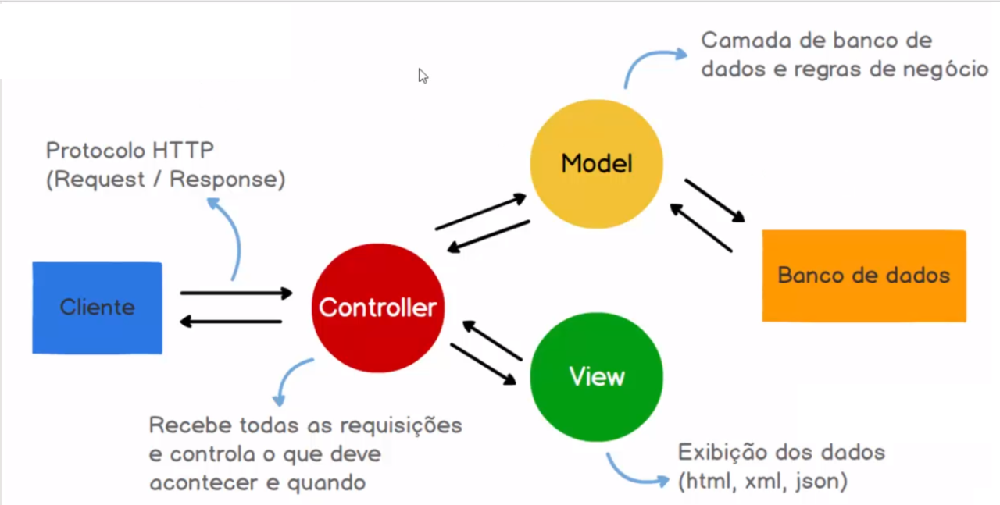

# Miniframework MVC em PHP

Bem-vindo ao Miniframework MVC em PHP! Este é um framework mínimo seguindo a arquitetura MVC (Model-View-Controller) para desenvolvimento web com PHP, incluindo uma camada de acesso a banco de dados. A seguir, você encontrará informações sobre o projeto, sua estrutura, como configurar e contribuir.

## Visão Geral

O Miniframework MVC é uma estrutura leve para desenvolvimento web em PHP. Ele oferece uma estrutura organizada para facilitar a criação de aplicativos web com PHP, incluindo uma camada de acesso a banco de dados para interações com MySQL.

## Tecnologias Utilizadas

- **PHP**: Linguagem de programação para lógica de aplicação.
- **HTML5 e CSS3**: Estruturação e estilização da interface do usuário.
- **MySQL**: Banco de dados para armazenamento de dados.

## Estrutura do Projeto

- `App/`: Lógica da aplicação seguindo o padrão MVC.
  - `Controllers/`: Controladores para lidar com a lógica da aplicação.
  - `Models/`: Modelos para representar dados e interações com o banco de dados.
  - `Views/`: Views para a apresentação da interface do usuário.
- `public/`: Recursos acessíveis publicamente (CSS, imagens, JavaScript).
- `config/`: Configurações gerais da aplicação.
- `vendor/`: Dependências do projeto gerenciadas pelo Composer.
- `database/`: Scripts SQL para criação do banco de dados.



## Principais Características

- **Estrutura MVC**: O framework segue o padrão Model-View-Controller (MVC) para melhorar a organização e a manutenção do código.

- **Roteamento Flexível**: O roteamento é configurável e suporta URLs amigáveis, permitindo que você defina facilmente as rotas para suas ações.

- **Templates Reutilizáveis**: Usa templates reutilizáveis para a criação de vistas, permitindo a separação clara entre a lógica e a apresentação.

## Requisitos de Instalação

Certifique-se de ter os seguintes requisitos instalados:

- PHP (versão 7.0 ou superior)
- Servidor web (por exemplo, Apache ou NGINX)
- Banco de dados MySQL

## Configuração

1. Clone o repositório: `git clone https://github.com/1bertojunior/miniframework.git`.
2. Configure o servidor web para apontar para o diretório `public/`.
3. Crie o banco de dados e as tabelas utilizando os scripts em `database/`.

## Rodando o Servidor PHP Localmente

Para rodar o servidor PHP localmente, abra o terminal no diretório do projeto e execute o seguinte comando:

```bash
php -S localhost:8000 -t public/
```

Este comando inicia um servidor PHP incorporado e aponta para o diretório public/. Abra o navegador e acesse http://localhost:8000 para visualizar a aplicação.

## Como Contribuir

1. Faça um fork do repositório.
2. Clone o fork para a sua máquina local.
3. Faça suas modificações e adições.
4. Envie um pull request para revisão.

## Agradecimentos

Obrigado por contribuir com o Miniframework MVC em PHP! Esperamos que esta estrutura facilite o desenvolvimento de aplicativos web utilizando PHP, seguindo as práticas do padrão MVC.

Divirta-se desenvolvendo com o Miniframework MVC em PHP!